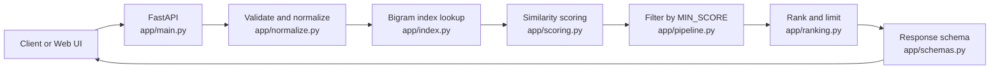

# Architecture

Fuzzyfind is a single FastAPI service. A request goes through validation, candidate lookup, scoring, filtering and ranking, and returns one JSON envelope. Everything runs in one process with an in-memory index, so there is no database or external service to set up.

## Request flow



`app/pipeline.py` runs the whole chain in one function, `search()`. The API layer only calls that function, which keeps HTTP concerns and search logic separate.

## Components

| File | Role | Main responsibility |
|---|---|---|
| `app/main.py` | HTTP layer | Routes, request models, error handlers. Serves the web UI at `/` |
| `app/normalize.py` | Input handling | Cleans and validates `query` and `limit`. Raises `QueryError` |
| `app/index.py` | Candidate lookup | Loads the dataset and builds a bigram inverted index |
| `app/scoring.py` | Similarity | Levenshtein ratio, Soundex boost, word-level and prefix scoring |
| `app/ranking.py` | Ordering | Sorts by score with deterministic tie-breaking, applies the limit |
| `app/schemas.py` | Contract | Pydantic models for the response and the error builder |
| `app/pipeline.py` | Orchestration | Connects all steps and builds the final response |
| `app/config.py` | Settings | Thresholds, limits and dataset path |
| `app/static/index.html` | Web UI | Pastel search page that calls `/api/search` and `/health` |
| `schema/response.schema.json` | Contract | JSON Schema for every response |
| `data/dataset.json` | Data | The searchable documents |

## Data model

Each document in `data/dataset.json`:

```json
{
  "id": "doc-01",
  "title": "Credit Card",
  "category": "Finance",
  "keywords": ["credit card", "banking", "payment", "card limit"]
}
```

The title and every keyword become separate searchable terms. The sample dataset has 8 documents, 34 terms and 115 distinct bigrams.

## Index (app/index.py)

The index is a dictionary from character bigrams to the set of term positions that contain them.

For the term `firewall`, the bigrams are `fi`, `ir`, `re`, `ew`, `wa`, `al`, `ll`.

At query time:

1. The query is split into bigrams.
2. Every term that shares at least one bigram becomes a candidate.
3. Only candidates are scored.

This means the scorer runs on a short list instead of the whole dataset. The index is built once at startup and held in memory.

## Scoring (app/scoring.py)

All scores use one scale, 0.0 to 1.0.

| Step | Rule |
|---|---|
| Base | Edit-distance ratio from `rapidfuzz` on lower-cased text. A pure-Python Levenshtein is the fallback if `rapidfuzz` is missing |
| Phonetic boost | Add 0.05 when the Soundex codes of query and term match |
| Word-level | For multi-word input, average the best score of each query word against the term's words |
| Partial penalty | If the term has more words than the query (`web` vs `web browser`), multiply by 0.90 |
| Prefix rule | A query word of 2+ letters that starts a term word (`ca` for `card`) scores at least 0.70 |
| Cap | Anything not string-identical is capped at 0.99. Only exact matches reach 1.0 |
| Threshold | Scores below `MIN_SCORE` (0.70) are dropped |

Match quality labels come from the final score: `very_high` at 0.90 or more, `high` at 0.75 or more, `medium` at 0.70 or more.

### Worked example

Query `firwall` against term `firewall`:

- The edit-distance ratio is about 0.9333.
- The Soundex codes match, so 0.05 is added, giving 0.9833.
- The score is below 1.0, so the cap does not change it.
- The result is 0.9833, labelled `very_high`.

## Ranking (app/ranking.py)

Results are sorted by these keys, in order:

1. Score, highest first, compared at 3 decimals so 0.8333 and 0.8334 tie.
2. Length closest to the query length.
3. Term, alphabetical.
4. Document id.

The fourth key makes the order independent of the input order. Only the best term per document is kept before ranking, so one document never fills several slots. The limit is applied after sorting and `rank` is assigned from 1.

## Error handling

`QueryError` carries a code, message and HTTP status. The API turns it into the standard envelope. Framework errors are converted as well:

| Source | Converted to |
|---|---|
| `QueryError` from validation | Its own code, HTTP 400 |
| FastAPI `RequestValidationError` | `INVALID_LIMIT` if `limit` is involved, otherwise `INVALID_REQUEST` (HTTP 400) |
| Starlette 404 and 405 | `NOT_FOUND` and `METHOD_NOT_ALLOWED` |
| Any other exception | `INTERNAL_ERROR` (HTTP 500), logged server-side, no details returned |

A search with no match is a normal result: HTTP 200, `success: true`, empty `results`.

## Configuration

All values are in `app/config.py`.

| Setting | Default | Purpose |
|---|---|---|
| `MIN_SCORE` | 0.70 | Lowest score returned |
| `DEFAULT_LIMIT` | 5 | Results when `limit` is omitted |
| `MAX_LIMIT` | 50 | Largest allowed `limit` |
| `MAX_QUERY_LENGTH` | 100 | Longest allowed query |
| `PARTIAL_TOKEN_PENALTY` | 0.90 | Multiplier for partial word matches |
| `PREFIX_SCORE` | 0.70 | Score for prefix matches |
| `DATASET_PATH` | `data/dataset.json` | Set with the `DATASET_PATH` environment variable |

## Design decisions

| Decision | Reason |
|---|---|
| One score scale from 0.0 to 1.0 | Earlier parts used 0 to 100 in some places, which made results hard to compare |
| Levenshtein with a bigram index | Runs in-process with no extra service, is deterministic and is easy to test |
| FastAPI | Request validation, `/docs` and Pydantic response models |
| One response envelope | Clients handle success and errors with the same structure |
| `MIN_SCORE` of 0.70 | Removes false positives found in testing, such as `banana` matching `Credit Card` at 0.571 |

More detail on these choices and the comparison with a search-engine approach is in [DESIGN_NOTES.md](DESIGN_NOTES.md).

## Limits and next steps

Known limits:

- Terms that share no two-letter pair with the query are never candidates, so queries like `a` return nothing.
- Two wrong letters in a 4-letter word score 0.50 and are not returned.
- The index is loaded once, so dataset edits need a restart.
- `MIN_SCORE` was tuned on 8 documents and needs re-tuning for a larger dataset.

If the dataset outgrows memory, replace the candidate lookup in `app/index.py` with a search engine's fuzzy query, such as Elasticsearch, OpenSearch or PostgreSQL `pg_trgm`. `app/scoring.py` and everything after it would not change.

## Testing

| File | Covers |
|---|---|
| `tests/test_units.py` | Normalization, scoring, ranking and index |
| `tests/test_api.py` | Endpoints, error cases and schema validation of each response |
| `tests/test_p6_cases.py` | 22 cases through the full pipeline |

Run all 75 tests with `python -m pytest -q`.
